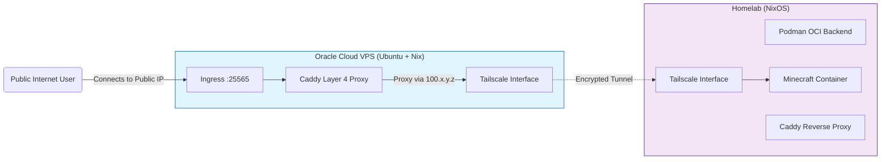

# ❄️ Tonga NixLab

> **A fully declarative, immutable infrastructure stack for self-hosting services, utilizing a hybrid architecture of NixOS and Nix-on-Ubuntu.**

   

  


## Overview

This repository contains the Infrastructure as Code (IaC) configuration for the **Tonga** homelab and its public-facing gateway. The core philosophy of this project is **strict reproducibility**. By leveraging Nix flakes, every component of the server—from the partition tables to the Minecraft server settings—is defined in code.

### The Hybrid Challenge

While the goal is pure NixOS everywhere, the public gateway runs on an Oracle VPS which presented specific technical limitations preventing a full NixOS install. To maintain declarative rigor, I implemented a **hybrid approach**:

  * **Homelab:** Pure **NixOS** (Immutable system).
  * **VPS Gateway:** **Ubuntu** bootstrapped with **Nix + Home Manager** (Declarative user-space).

## 🏗 Architecture
> “This containers revolution is changing the basic act of software consumption. It’s redefining this much more lightweight, portable unit, or atom, that is much easier to manage… It’s a gateway to dynamic management and dynamic systems.” – Craig McLuckie, Google.

The network utilizes a **Zero Trust** model. No ports are open on the Homelab's public IP. All ingress traffic is routed through the VPS Gateway via a Tailscale mesh, using Caddy for Layer 4 proxying.



## Key Features

### 🛡️ Secure Ingress Gateway

Instead of exposing the home IP, an Oracle VPS acts as a shield.

  * **Caddy L4 Proxy:** Uses `caddy-l4` to proxy raw TCP traffic  over Tailscale.
  * **Tailscale Mesh:** The VPS and Homelab communicate over an encrypted WireGuard mesh. The VPS bans malicious IPs via **Fail2Ban** but whitelists the Tailscale subnet (`100.0.0.0/8`).

### ❄️ Declarative Services

Services are defined in Nix, ensuring that `rebuild switch` brings the system to the exact desired state.

  * **Minecraft:** Configured via `virtualisation.oci-containers`. The entire server state, including hardware configuration, Message of the Day (MOTD), and whitelist, is version controlled.
  * **Reverse Proxy:** Caddy handles internal HTTPS with automatic ACME DNS challenges via Cloudflare, enabling wildcard certs (`*.tongatime.us`) without opening ports.

### 🚀 Reproducible Deployment Environment
> It works on my machine! - Everyone

To solve the "it works on my machine" problem for deployment, the deployer itself is containerized.

  * **Containerfile:** A custom Docker image (`homelab-deployer`) pre-installs `nixos-rebuild`, `nixos-anywhere`, and SSH configs.
  * **Bootstrap Script:** `deploy-vps.sh` automates the conversion of a fresh Ubuntu box into a Nix-managed node, installing the Nix daemon, setting up trusted users, and applying the Home Manager flake.

## 🛠️ Technical Stack
> "Oh, and you’re going to be lighter weight than a VM? Awesome. I’m all about containers now.” – Steven Pousty, Red Hat. 

| Component | Technology | Description |
| :--- | :--- | :--- |
| **OS (Home)** | NixOS 24.11 | Pure, immutable Linux distribution. |
| **OS (VPS)** | Ubuntu + Home Manager | Declarative user configuration on traditional Linux. |
| **Containers** | Podman | Daemonless container engine (Docker compatible). |
| **Storage** | Disko | Declarative disk partitioning and formatting. |
| **Networking** | Tailscale | Mesh VPN for secure internal communication. |
| **Proxy** | Caddy | Web server with Layer 4 and Reverse Proxy capabilities. |

## 📂 Directory Structure

```graphql
.
├── build-deployer.sh     # Builds the deployment container
├── configuration.nix     # Main NixOS Homelab configuration
├── Containerfile         # Definition of the reproducible deployer image
├── containers/           # Service definitions (Podman)
│   ├── default.nix       # Imports active containers
│   └── minecraft.nix     # Minecraft server OCI config
├── deploy-nix.sh         # Script to deploy to Homelab
├── deploy-vps.sh         # Script to bootstrap and deploy to VPS
├── disko-config.nix      # ZFS/EXT4 partition layouts
├── flake.nix             # Entry point for system configurations
├── network/              # Networking configuration
│   ├── caddy.nix         # Reverse proxy & ACME settings
│   └── tailscale.nix     # VPN configuration
└── vps/                  # VPS-specific configuration
    ├── home.nix          # Home Manager config for Ubuntu
    └── configuration.nix # Partial system config
```

## 🚀 Deployment Guide

### Prerequisites

  * Podman installed on your local machine.
  * SSH access to target hosts.
  * A `secrets/` directory (ignored by git) containing API tokens and private SSH keys.

### 1\. The Deployer

Build the hermetic deployment environment. This ensures you are using the exact same version of `nix` and `nixos-rebuild` regardless of your host OS.

```bash
./build-deployer.sh
```

### 2\. Deploying to Homelab (NixOS)

To update the main server:

```bash
./deploy-nix.sh          # Updates existing system
./deploy-nix.sh --install # Wipes disk and installs fresh (NixOS Anywhere)
```

### 3\. Deploying to VPS (Ubuntu)

To bootstrap or update the gateway:

```bash
./deploy-vps.sh
```

*This script will SSH into the Ubuntu host, install the Nix package manager if missing, configure multi-user support, and apply the `homeConfigurations."ubuntu"` flake output.*

## 🗺️ Roadmap

Future plans are documented in the project TODOs.

👉 **See [TODO.md](https://github.com/TaylorTurnerIT/nixserver/blob/master/README.md) for the full roadmap.**

-----

**[View Source](https://github.com/taylorturnerit/nixserver)**
